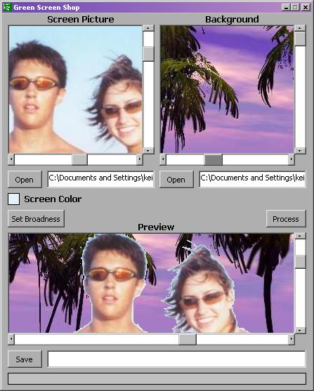



## Green Screen

### Description

Create green screen effects like they do in the movies. Select the screen color and the broadness of the color. Modify it to fit your needs. Enjoy!
 
### More Info
 

             |
---                |---
**Submitted On**   |2005-03-01 06:24:24
**By**             |[keith\_escalade](https://github.com/Planet-Source-Code/PSCIndex/blob/master/ByAuthor/keith-escalade.md)
**Level**          |Intermediate
**User Rating**    |3.7 (11 globes from 3 users)
**Compatibility**  |VB 6\.0
**Category**       |[Graphics](https://github.com/Planet-Source-Code/PSCIndex/blob/master/ByCategory/graphics__1-46.md)
**World**          |[Visual Basic](https://github.com/Planet-Source-Code/PSCIndex/blob/master/ByWorld/visual-basic.md)
**Archive File**   |[Green\_Scre185917312005\.zip](https://github.com/Planet-Source-Code/keith-escalade-green-screen__1-59224/archive/master.zip)

